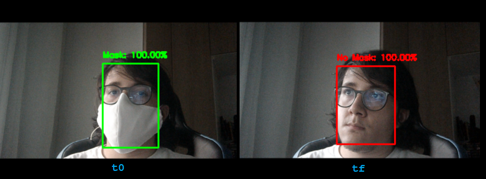

# ConEg-Inspector
Intelligent inspector which detects faces (not) wearing masks

At the current state of this project, NN model is already created so there's no
need to train it again (unless you want to, follow [this](train/train_inspector.ipynb)notebook).

## How-to Run
Given to some OpenCV limitations, it's recommended to run this on a Windows machine
with Python 3.7 (tested with 3.7.9) and install libs from [requirements](requirements.txt).
First check if [configuration](config/config_insp.yaml) file is according the expected by your needs.
With all set-up, run `python detect_mask_video.py` to start the live face detection.

## Caveat
As this project is directly related to [ConEg repo](https://github.com/marcosatsf/coneg-project), it's recommended run the whole project in order to see the expected result when this was built, this means, when detected a face with or no mask, a request is sent to an API project that will handle that event.
